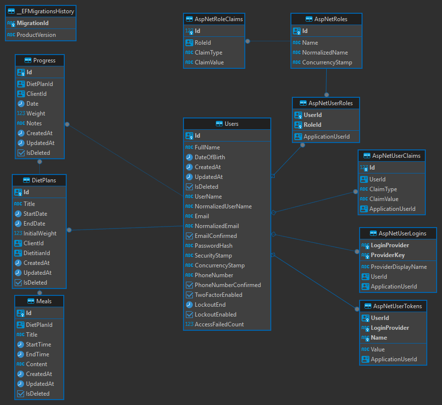

# 🥗 Diet Management System

A comprehensive diet management system built with .NET 8, designed to help dietitians manage their clients' diet plans and track their progress effectively.

## 📋 Table of Contents

- [Database Schema](#-database-schema)
- [Features](#-features)
- [Technology Stack](#-technology-stack)
- [Project Structure](#-project-structure)
- [Getting Started](#-getting-started)
- [API Documentation](#-api-documentation)
- [Security](#-security)
- [Deployment](#-deployment)
- [Contributing](#-contributing)
- [License](#-license)
- [Author](#-author)

## 📊 Database Schema



## 🚀 Features

### User Management
- **Role-based Access Control**
  - Admin: Full system access
  - Dietitian: Client and diet plan management
  - Client: View assigned plans and track progress
- **Authentication & Authorization**
  - JWT-based authentication
  - Secure password hashing
  - Role-based authorization policies

### Diet Plan Management
- **Comprehensive Plan Creation**
  - Customizable meal schedules
  - Nutritional requirements tracking
  - Client-specific adjustments
  - Progress monitoring integration
- **Plan Assignment**
  - Multiple client assignments
  - Plan versioning
  - Historical tracking

### Meal Management
- **Detailed Meal Planning**
  - Nutritional information tracking
  - Ingredient management
  - Portion control
  - Meal timing scheduling

### Progress Tracking
- **Comprehensive Monitoring**
  - Weight tracking
  - Body measurements
  - Nutritional intake
  - Goal setting and tracking

## 🛠️ Technology Stack

### Backend
- **Framework**: .NET 8
- **Architecture**: Clean Architecture with CQRS
- **ORM**: Entity Framework Core
- **Authentication**: JWT with ASP.NET Identity
- **Validation**: FluentValidation
- **Documentation**: Swagger/OpenAPI
- **Testing**: nUnit, Moq, FluentAssertions

### Database
- **Primary Database**: PostgreSQL
- **ORM**: Entity Framework Core
- **Migrations**: EF Core Migrations
- **Connection**: Npgsql.EntityFrameworkCore.PostgreSQL

### Development Tools
- **IDE**: Visual Studio 2022 / VS Code
- **Version Control**: Git
- **API Testing**: Postman
- **Database Management**: DBeaver
- **Containerization**: Docker

## 📁 Project Structure

```
DietManagementSystem/
├── src/
│   ├── DietManagementSystem.Domain/         # Domain layer
│   │   ├── Entities/                        # Domain models
│   │
│   ├── DietManagementSystem.Application/    # Application layer
│   │   ├── Features/                        # CQRS handlers
│   │   │   ├── User/                       # User-related features
│   │   │   ├── DietPlan/                   # Diet plan features
│   │   │   ├── Meal/                       # Meal features
│   │   │   └── Progress/                   # Progress tracking
│   │   ├── Validators/                      # Validation rules
│   │   ├── DTOs/                           # Data transfer objects
│   │   └── Extensions/                      # Service extensions
│   │
│   ├── DietManagementSystem.Persistence/    # Infrastructure layer
│   │   ├── Context/                         # DbContext
│   │   ├── Interfaces/                      # Repository interfaces
│   │   ├── Repositories/                    # Repository implementations
│   │   ├── Configurations/                  # Entity configurations
│   │   └── Seed/                           # Data seeding
│   │
│   └── DietManagementSystem.WebApi/         # Presentation layer
│       ├── Controllers/                     # API endpoints
│       ├── Extensions/                      # Web API extensions
│       ├── Middleware/                      # Custom middleware
│       └── Filters/                         # Action filters
```

## 🚀 Getting Started

### Prerequisites

#### Windows
- [.NET 8 SDK](https://dotnet.microsoft.com/download/dotnet/8.0)
- [PostgreSQL](https://www.postgresql.org/download/)
- [Docker Desktop for Windows](https://www.docker.com/products/docker-desktop) (optional)

#### macOS
- [.NET 8 SDK](https://dotnet.microsoft.com/download/dotnet/8.0)
- [PostgreSQL](https://www.postgresql.org/download/macosx/) or [Postgres.app](https://postgresapp.com/)
- [Docker Desktop for Mac](https://www.docker.com/products/docker-desktop) (optional)
- [Homebrew](https://brew.sh/) (recommended for package management)

### Installation

#### Windows Installation
1. **Clone the Repository**
   ```bash
   git clone https://github.com/yourusername/DietManagementSystem.git
   cd DietManagementSystem
   ```

2. **Database Setup**
   ```bash
   # Using Docker
   docker-compose -f dms_local_compose/docker-compose.yml up -d
   
   # Or manually create PostgreSQL database
   # Update connection string in appsettings.json
   ```

3. **Build and Run**
   ```bash
   dotnet restore
   dotnet build
   dotnet run --project src/DietManagementSystem.WebApi
   ```

#### macOS Installation
1. **Install Dependencies**
   ```bash
   # Install .NET SDK
   brew install --cask dotnet-sdk

   # Install PostgreSQL (if not using Docker)
   brew install postgresql@14
   brew services start postgresql@14

   # Install Docker Desktop (if using Docker)
   brew install --cask docker
   ```

2. **Clone the Repository**
   ```bash
   git clone https://github.com/yourusername/DietManagementSystem.git
   cd DietManagementSystem
   ```

3. **Database Setup**
   ```bash
   # Using Docker
   docker-compose -f dms_local_compose/docker-compose.yml up -d
   
   # Or using PostgreSQL installed via Homebrew
   createdb diet_management_db
   # Update connection string in appsettings.json
   ```

4. **Build and Run**
   ```bash
   dotnet restore
   dotnet build
   dotnet run --project src/DietManagementSystem.WebApi
   ```

5. **Troubleshooting on macOS**
   - If you encounter permission issues:
     ```bash
     sudo chown -R $(whoami) /usr/local/share/dotnet
     ```
   - If PostgreSQL connection fails:
     ```bash
     brew services restart postgresql@14
     ```
   - If Docker issues occur:
     ```bash
     open -a Docker
     # Wait for Docker to start, then try again
     ```

4. **Initial Setup**
   - Access Swagger UI at `https://localhost:8081/swagger`
   - Access Swagger UI at `http://localhost:8080/swagger`
   - Default admin credentials:
     - Email: admin@diet.com
     - UserName: "admin"
     - Password: Admin123!

### Running Tests

#### Windows
1. **Run All Tests**
   ```bash
   dotnet test
   ```

2. **Run Specific Test Project**
   ```bash
   dotnet test src/DietManagementSystem.Tests
   ```

3. **Run Tests with Coverage**
   ```bash
   # Install coverlet if not already installed
   dotnet tool install -g coverlet.console

   # Run tests with coverage
   dotnet test /p:CollectCoverage=true /p:CoverletOutputFormat=opencover
   ```

4. **View Test Results**
   - Test results will be displayed in the console
   - For detailed results, check the `TestResults` folder in each test project

#### macOS
1. **Run All Tests**
   ```bash
   dotnet test
   ```

2. **Run Specific Test Project**
   ```bash
   dotnet test src/DietManagementSystem.Tests
   ```

3. **Run Tests with Coverage**
   ```bash
   # Install coverlet if not already installed
   dotnet tool install -g coverlet.console

   # Run tests with coverage
   dotnet test /p:CollectCoverage=true /p:CoverletOutputFormat=opencover
   ```

4. **View Test Results**
   - Test results will be displayed in the console
   - For detailed results, check the `TestResults` folder in each test project

5. **Troubleshooting on macOS**
   - If you encounter permission issues:
     ```bash
     sudo chown -R $(whoami) /usr/local/share/dotnet
     ```
   - If tests fail due to database connection:
     ```bash
     # Make sure PostgreSQL is running
     brew services start postgresql@14
     ```

## 🔒 Security

### Authentication
- JWT-based authentication
- Secure password hashing
- Role-based authorization

### Best Practices
- Secure headers
- Request validation
- Error handling
- Logging and monitoring

## 🚀 Deployment

### Development Environment
```bash
# Using Docker
docker-compose -f dms_local_compose/docker-compose.yml up -d

# Or run directly
dotnet run --project src/DietManagementSystem.WebApi
```

### Production Environment
```bash
# Build and run with Docker
docker-compose up -d

# Or deploy to Azure/AWS
# Follow platform-specific deployment guides
```

## 🤝 Contributing

1. Fork the repository
2. Create your feature branch (`git checkout -b feature/AmazingFeature`)
3. Commit your changes (`git commit -m 'Add some AmazingFeature'`)
4. Push to the branch (`git push origin feature/AmazingFeature`)
5. Open a Pull Request

### Development Guidelines
- Follow Clean Architecture principles
- Write unit tests for new features
- Use meaningful commit messages
- Update documentation
- Follow existing code style

## 📄 License

This project is licensed under the MIT License - see the [LICENSE](LICENSE) file for details.

## 👥 Author

- Muharrem TEKIN

## 📚 API Documentation

The API follows RESTful principles and uses JWT authentication. All endpoints require an Authorization header with a valid JWT token.

### Authentication
All API requests must include the following header:
```plaintext
Authorization: Bearer {your_jwt_token}
```

### Controllers

#### Admin Controller
The Admin Controller manages administrator accounts and system-wide operations.

- **Create Administrator**: `POST /api/v1/admins`
- **Update Administrator**: `PUT /api/v1/admins/{userId}`
- **Delete Administrator**: `DELETE /api/v1/admins/{userId}`
- **Get All Administrators**: `GET /api/v1/admins`

For detailed request/response examples, see [AdminControllerExamples.md](src/DietManagementSystem.WebApi/Documentation/AdminControllerExamples.md)

#### Dietitian Controller
The Dietitian Controller manages dietitian accounts and their operations.

- **Create Dietitian**: `POST /api/v1/dietitians`
- **Update Dietitian**: `PUT /api/v1/dietitians/{userId}`
- **Delete Dietitian**: `DELETE /api/v1/dietitians/{userId}`
- **Get All Dietitians**: `GET /api/v1/dietitians`

For detailed request/response examples, see [DietitianControllerExamples.md](src/DietManagementSystem.WebApi/Documentation/DietitianControllerExamples.md)

#### Meal Controller
The Meal Controller manages meal planning and scheduling.

- **Create Meal**: `POST /api/v1/meals`
- **Update Meal**: `PUT /api/v1/meals/{mealId}`
- **Delete Meal**: `DELETE /api/v1/meals/{mealId}`
- **Get Meal by ID**: `GET /api/v1/meals/{mealId}`
- **Get All Meals**: `GET /api/v1/meals`
- **Get Meals by Diet Plan**: `GET /api/v1/meals/dietplan/{dietPlanId}`

For detailed request/response examples, see [MealControllerExamples.md](src/DietManagementSystem.WebApi/Documentation/MealControllerExamples.md)

#### Progress Controller
The Progress Controller manages client progress tracking.

- **Create Progress Record**: `POST /api/v1/progress`
- **Update Progress Record**: `PUT /api/v1/progress/{progressId}`
- **Delete Progress Record**: `DELETE /api/v1/progress/{progressId}`
- **Get Progress Record by ID**: `GET /api/v1/progress/{progressId}`
- **Get All Progress Records**: `

